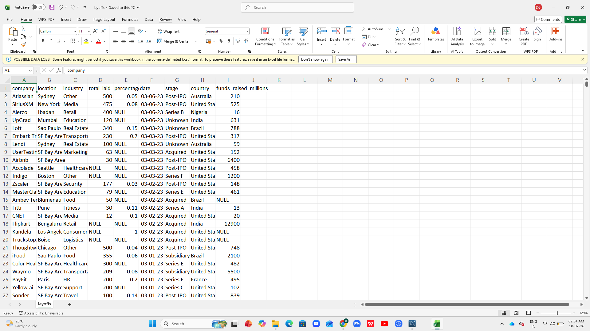
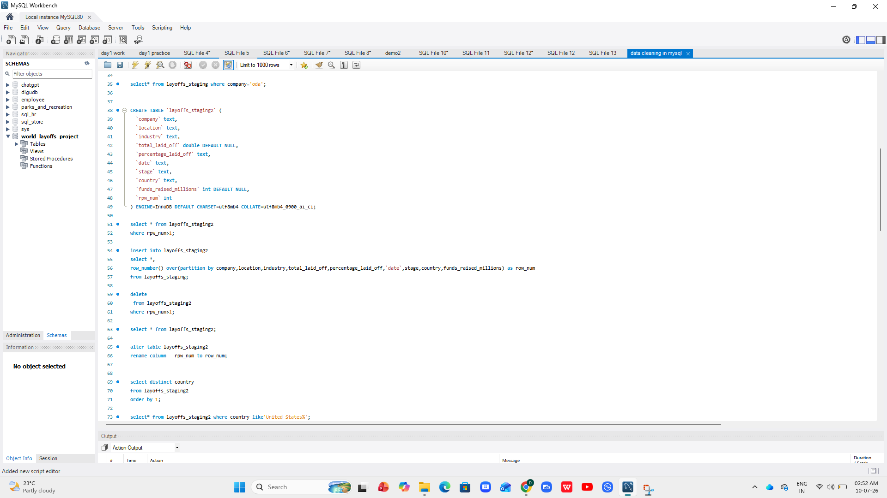
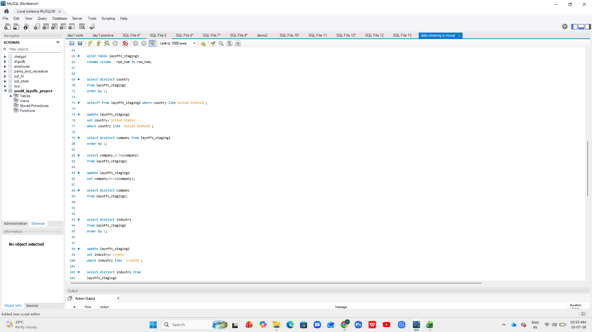
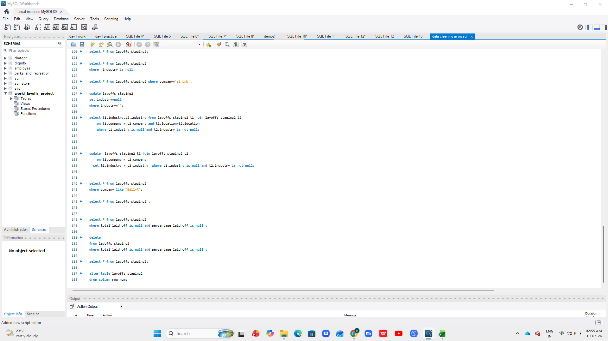
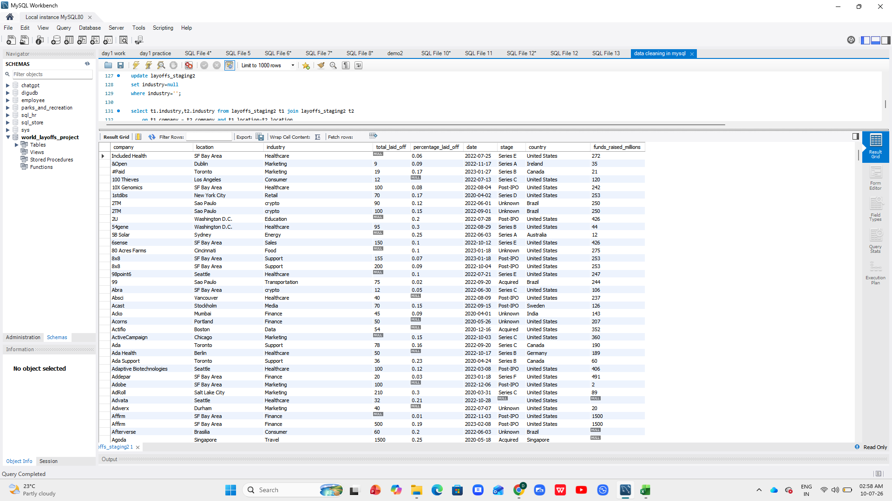

# SQL Data Cleaning Project using MySQL

## 📌 Project Overview

This project demonstrates the process of cleaning and preparing the Global Layoffs dataset using MySQL.

The objective of this project is to transform raw data into a clean and analysis-ready dataset by applying various SQL data cleaning techniques.

---

## 📂 Dataset

- Dataset: Global Layoffs Dataset
- Source: Kaggle
- Database: MySQL

---

## 🛠 Tools Used

- MySQL
- SQL

---

## 📋 Data Cleaning Tasks Performed

- Removed duplicate records
- Standardized company names
- Standardized industry values
- Converted date format
- Handled NULL and blank values
- Removed unnecessary rows
- Created a clean staging table

---

## 💻 SQL Concepts Used

- SELECT
- CREATE TABLE
- INSERT INTO
- UPDATE
- DELETE
- ALTER TABLE
- Common Table Expressions (CTEs)
- ROW_NUMBER()
- String Functions
- Date Functions

---

## 📁 Project Files

- README.md
- layoffs.csv
- SQL_Data_Cleaning.sql

---

## 📚 Learning Note

This project was completed as part of my SQL learning journey by following Alex The Analyst's SQL Data Cleaning Portfolio Project.

I independently executed all SQL queries in MySQL, understood each data cleaning step, and documented the project in this repository as part of my learning portfolio.

---

## 👨‍💻 Author

**Diganth Gowda**

Aspiring Data Analyst

## 📸 Project Screenshots

### 📂 Raw Dataset

---

### 💻 SQL Data Cleaning Queries

---

### ✅ Cleaned Dataset

